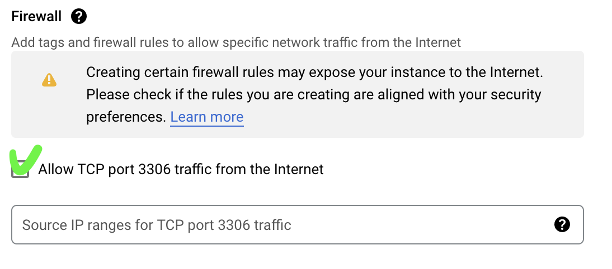
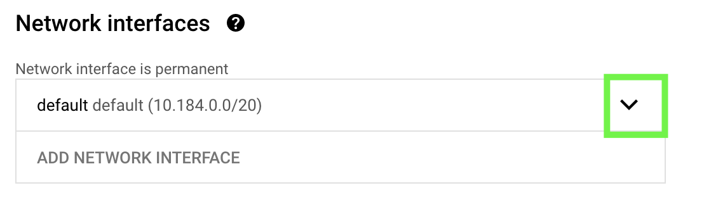
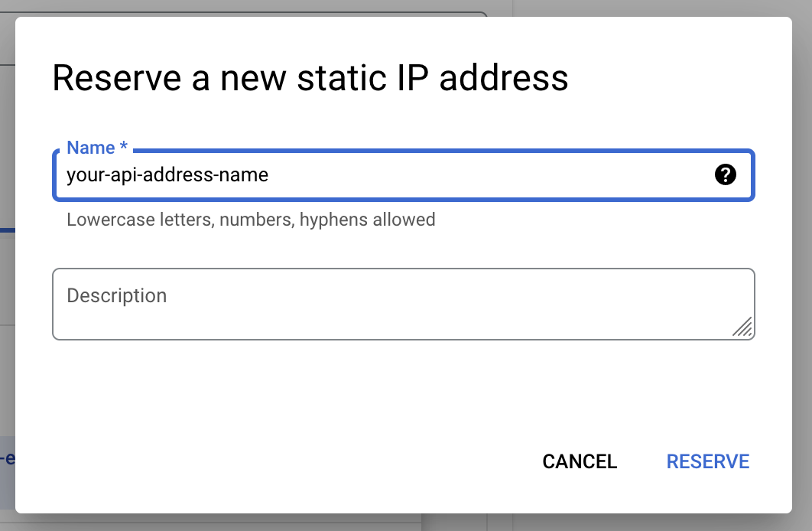

# Express.js Demo for CC-25
> Part of Bangkit 2022 🇮🇩🇮🇩🇮🇩

## Stack used
1. 🟨 Express.js Web Framework
2. 💾 MySQL 8.0

## Google Cloud Service used
1. 💾 Cloud Storage
2. ⚡️ Cloud Run
3. 🖥 Compute Engine
4. 🤖 Vertex AI

## Local requirements
1. 🟨 Node.js
2. 🐳 Docker
3. 🚦 Any IDE you like

## 👨🏽‍💻 How to use in local
1. Clone this repositroy
2. Run `npm install`
3. Create `.env` file in root folder with this specifications

| Variables             | Function                | Example       |
| --------------------- |:-----------------------:| -------------:|
| PORT                  | your_API_port           | 8080          |
| TOKEN_KEY             | your_bcrypt_auth_token  | YVTiYss7HOU=  |
| MYSQL_ROOT_USER       | your_mysql_root_user    | root          |
| MYSQL_ROOT_PASSWORD   | your_mysql_root_pass    | passw0rd      |
| MYSQL_HOST            | your_mysql_host_address | 0.0.0.0       |

4. Run `docker run --name expressjs-demo-mysql -e MYSQL_ROOT_PASSWORD=passw0rd -p 0.0.0.0:3306:3306 -d mysql:8.0`
5. Run `docker exec -it expressjs-demo-mysql bash`
6. Populate Database with `init_mysql.sql` by:
    1. Run `sudo mysql -p`
    2. Type your password same as `MYSQL_ROOT_PASSWORD`
    3. Copy paste all sql script in `init_mysql.sql`
    4. Exit mysql cli with `exit`
7. Exit docker with `exit`
8. Run application with `npm run dev`

## ☁️ How to use in Cloud

### ⚡️ Deploy MySQL Database in Compute Engine
1. Use this [link](https://console.cloud.google.com/marketplace/product/click-to-deploy-images/mysql) to deploy Virtual Machine with MySQL automatically installed
2. Click **Launch** and **Enable API Needed**
3. In Deployment page, setup your Virtual Machine
4. Make sure to checklist `Allow TCP port ...` so you can test your database from local

5. Checklist Term of Services
6. Deploy and wait
7. **📝 Note your MySQL user and password**
8. SSH to Virtual Machine
9. Run `sudo apt update && sudo apt install git`
10. Clone this repository
11. Run `cd expressjs-demo`
12. Run `sudo mysql -p < init_mysql.sql`
13. Type your password
14. Done. You can exit SSH
15. Go to GCP Console > Compute Engine
16. Click your MySQL Virtual Machine
17. Stop it
18. Click Edit
19. In `Network Interface`, click the dropdown

20. In `External IPv4 address`, click the dropdown and click `Create IP Address`
21. Give your IP name and click `Reverse`

22. Click Done and then Save
23. Wait and start your Virtual Machine again
24. **📝 Note your external IP address**

### ⚡️ Deploy API into Cloud Run
1. In file `.env` changes your `MYSQL_ROOT_USER`, `MYSQL_ROOT_PASSWORD`, and `MYSQL_HOST` with your 📝 Note from step 7 and 24
2. Run `export PROJECT_ID=$(gcloud config get-value project)`
3. Run `docker build -t gcr.io/$PROJECT_ID/expressjs-demo:v1.0 .`
4. Run `gcloud auth configure-docker` and press `Y`
5. Run `docker push gcr.io/$PROJECT_ID/expressjs-demo:v1.0`
6. Run `gcloud run deploy --image gcr.io/$PROJECT_ID/expressjs-demo:v1.0 --platform managed`
7. Check your GCP Console > Cloud Run

References : 

[1] https://medium.com/@rahulguptalive/create-crud-apis-in-nodejs-express-and-mysql-abda4dfc2d6

[2] https://www.section.io/engineering-education/how-to-build-authentication-api-with-jwt-token-in-nodejs/

[3] https://stackoverflow.com/questions/40076638/compare-passwords-bcryptjs

[4] https://nodejs.org/en/docs/guides/nodejs-docker-webapp/